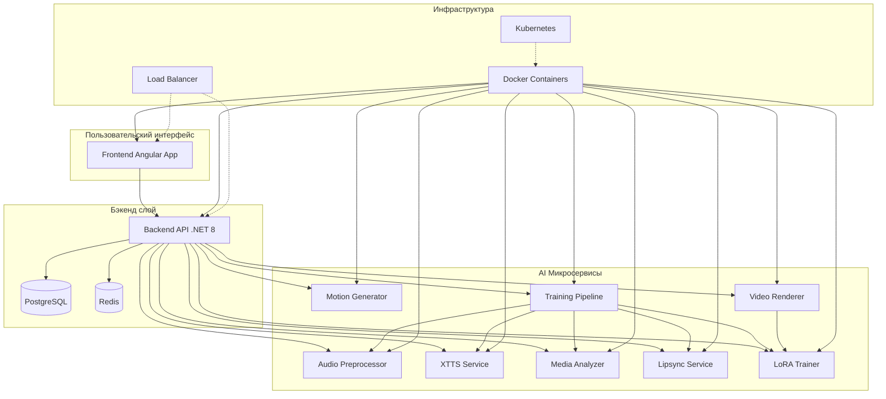
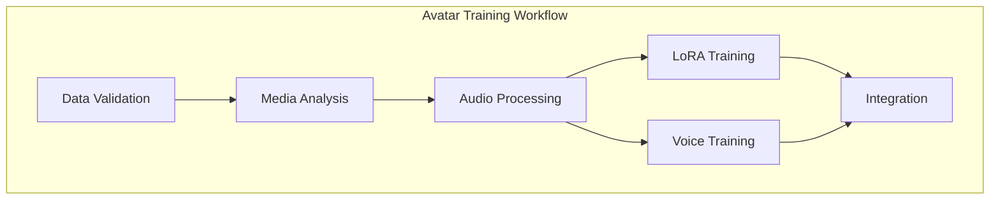
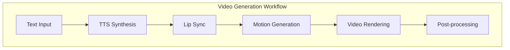
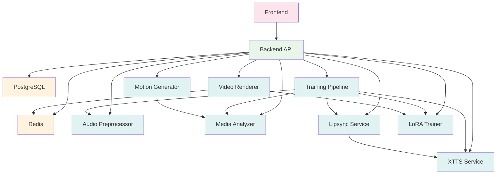

# Визуализация графа знаний проекта Avatar AI

## 1. Mermaid.js диаграмма архитектуры

```mermaid
graph TB
    %% Основные сущности проекта
    subgraph "Проект Avatar AI"
        PA[Project: Avatar AI]
    end
    
    subgraph "Технологический стек"
        TSF[TechStack: Frontend]
        TSB[TechStack: Backend]
        TSAI[TechStack: AI Services]
        AC[Architecture: Clean Architecture]
    end
    
    subgraph "Сервисы"
        DB[Service: PostgreSQL]
        RD[Service: Redis]
        BE[Service: Backend API]
        FE[Service: Frontend]
        
        subgraph "AI Сервисы"
            AP[Service: Audio Preprocessor]
            XT[Service: XTTS Service]
            MA[Service: Media Analyzer]
            LS[Service: Lipsync Service]
            LT[Service: LoRA Trainer]
            MG[Service: Motion Generator]
            VR[Service: Video Renderer]
            TP[Service: Training Pipeline]
        end
    end
    
    subgraph "Доменные сущности"
        DU[Domain Entity: User]
        DA[Domain Entity: Avatar]
        DGT[Domain Entity: GenerationTask]
        DTL[Domain Entity: TaskLog]
    end
    
    subgraph "Frontend компоненты"
        FCH[Frontend Component: Home]
        FCD[Frontend Component: Dashboard]
        FCA[Frontend Component: Avatars]
        FCAD[Frontend Component: AvatarDetail]
        FCT[Frontend Component: Training]
        FCG[Frontend Component: Generation]
        FCL[Frontend Component: Login]
        FCR[Frontend Component: Register]
        FCF[Frontend Component: ForgotPassword]
        FCTL[Frontend Component: TaskList]
        FCTD[Frontend Component: TaskDetail]
    end
    
    subgraph "AI Возможности"
        AITTS[AI Capability: Text-to-Speech]
        AILS[AI Capability: Lip Sync]
        AILT[AI Capability: LoRA Training]
        AIMG[AI Capability: Motion Generation]
        AIVR[AI Capability: Video Rendering]
        AIMA[AI Capability: Media Analysis]
        AIAP[AI Capability: Audio Processing]
    end
    
    subgraph "Workflow процессы"
        WAT[Workflow: Avatar Training]
        WVG[Workflow: Video Generation]
        WDP[Workflow: Data Processing]
    end
    
    subgraph "Тестирование"
        TUT[Testing: Unit Tests]
        TIT[Testing: Integration Tests]
        TFT[Testing: Frontend Tests]
    end
    
    subgraph "Инфраструктура"
        ID[Infrastructure: Docker]
        IK[Infrastructure: Kubernetes]
        DPP[Deployment: Production]
        DPD[Deployment: Development]
    end
    
    %% Связи проекта
    PA -->|uses| TSF
    PA -->|uses| TSB
    PA -->|uses| TSAI
    PA -->|implements| AC
    
    %% Связи сервисов
    PA -->|uses| DB
    PA -->|uses| RD
    PA -->|uses| BE
    PA -->|uses| FE
    PA -->|uses| AP
    PA -->|uses| XT
    PA -->|uses| MA
    PA -->|uses| LS
    PA -->|uses| LT
    PA -->|uses| MG
    PA -->|uses| VR
    PA -->|uses| TP
    
    %% Зависимости между сервисами
    BE -->|depends_on| DB
    BE -->|depends_on| RD
    FE -->|depends_on| BE
    TP -->|depends_on| AP
    TP -->|depends_on| MA
    TP -->|depends_on| XT
    TP -->|depends_on| LT
    TP -->|depends_on| LS
    VR -->|depends_on| LT
    VR -->|depends_on| RD
    
    %% Доменные сущности
    BE -->|manages| DU
    BE -->|manages| DA
    BE -->|manages| DGT
    BE -->|manages| DTL
    
    DA -->|belongs_to| DU
    DGT -->|belongs_to| DA
    DTL -->|belongs_to| DGT
    
    DB -->|stores| DU
    DB -->|stores| DA
    DB -->|stores| DGT
    DB -->|stores| DTL
    
    %% Frontend компоненты
    FE -->|contains| FCH
    FE -->|contains| FCD
    FE -->|contains| FCA
    FE -->|contains| FCAD
    FE -->|contains| FCT
    FE -->|contains| FCG
    FE -->|contains| FCL
    FE -->|contains| FCR
    FE -->|contains| FCF
    FE -->|contains| FCTL
    FE -->|contains| FCTD
    
    FCA -->|displays| DA
    FCAD -->|displays| DA
    FCG -->|creates| DGT
    FCTL -->|displays| DGT
    FCTD -->|displays| DGT
    FCTD -->|displays| DTL
    
    %% AI возможности
    XT -->|provides| AITTS
    LS -->|provides| AILS
    LT -->|provides| AILT
    MG -->|provides| AIMG
    VR -->|provides| AIVR
    MA -->|provides| AIMA
    AP -->|provides| AIAP
    
    TP -->|orchestrates| AILT
    TP -->|orchestrates| AITTS
    TP -->|orchestrates| AILS
    TP -->|orchestrates| AIAP
    TP -->|orchestrates| AIMA
    
    %% Workflow процессы
    PA -->|implements| WAT
    PA -->|implements| WVG
    PA -->|implements| WDP
    
    WAT -->|executed_by| TP
    WVG -->|orchestrated_by| BE
    WDP -->|uses| AP
    WDP -->|uses| MA
    
    WAT -->|requires| AILT
    WAT -->|requires| AITTS
    WAT -->|requires| AIAP
    WAT -->|requires| AIMA
    
    WVG -->|requires| AITTS
    WVG -->|requires| AILS
    WVG -->|requires| AIMG
    WVG -->|requires| AIVR
    
    %% Тестирование
    PA -->|includes| TUT
    PA -->|includes| TIT
    PA -->|includes| TFT
    
    TUT -->|tests| BE
    TIT -->|tests| DB
    TIT -->|tests| BE
    TFT -->|tests| FE
    
    %% Инфраструктура
    PA -->|uses| ID
    PA -->|supports| IK
    PA -->|supports| DPP
    PA -->|supports| DPD
    
    ID -->|containerizes| DB
    ID -->|containerizes| RD
    ID -->|containerizes| BE
    ID -->|containerizes| FE
    ID -->|containerizes| XT
    ID -->|containerizes| LS
    ID -->|containerizes| LT
    ID -->|containerizes| VR
    
    %% Стилизация
    classDef project fill:#e1f5fe,stroke:#01579b,stroke-width:2px
    classDef tech fill:#f3e5f5,stroke:#4a148c,stroke-width:2px
    classDef service fill:#e8f5e8,stroke:#1b5e20,stroke-width:2px
    classDef domain fill:#fff3e0,stroke:#e65100,stroke-width:2px
    classDef frontend fill:#fce4ec,stroke:#880e4f,stroke-width:2px
    classDef ai fill:#e0f2f1,stroke:#004d40,stroke-width:2px
    classDef workflow fill:#f3e5f5,stroke:#4a148c,stroke-width:2px
    classDef testing fill:#fff8e1,stroke:#ff6f00,stroke-width:2px
    classDef infra fill:#e8eaf6,stroke:#283593,stroke-width:2px
    
    class PA project
    class TSF,TSB,TSAI,AC tech
    class DB,RD,BE,FE,AP,XT,MA,LS,LT,MG,VR,TP service
    class DU,DA,DGT,DTL domain
    class FCH,FCD,FCA,FCAD,FCT,FCG,FCL,FCR,FCF,FCTL,FCTD frontend
    class AITTS,AILS,AILT,AIMG,AIVR,AIMA,AIAP ai
    class WAT,WVG,WDP workflow
    class TUT,TIT,TFT testing
    class ID,IK,DPP,DPD infra
```



## 2. Упрощенная архитектурная диаграмма



## 3. Workflow диаграммы

### Workflow обучения аватара


### Workflow генерации видео


## 4. Диаграмма зависимостей сервисов



## 5. Как использовать эти диаграммы

### Для документации:
1. Вставьте Mermaid диаграммы в README.md
2. Используйте для архитектурной документации
3. Добавьте в техническую документацию проекта

### Для презентаций:
1. Экспортируйте как PNG/SVG
2. Используйте в слайдах
3. Создайте интерактивные версии

### Для разработки:
1. Обновляйте при изменениях архитектуры
2. Используйте для планирования новых фич
3. Анализируйте зависимости при рефакторинге

## 6. Генерация изображений

Чтобы преобразовать Mermaid диаграммы в изображения:

1. **Онлайн инструменты**:
   - [Mermaid Live Editor](https://mermaid.live/)
   - [Mermaid CLI](https://github.com/mermaid-js/mermaid-cli)

2. **Локальная генерация**:
```bash
# Установка mermaid-cli
npm install -g @mermaid-js/mermaid-cli

# Генерация PNG
mmdc -i architecture.mmd -o architecture.png

# Генерация SVG
mmdc -i architecture.mmd -o architecture.svg
```

3. **VS Code расширение**:
   - Установите расширение "Markdown Preview Mermaid Support"
   - Просматривайте диаграммы прямо в редакторе

## 7. Автоматическое обновление

Для автоматического обновления диаграмм при изменениях в графе знаний:

1. Создайте скрипт для экспорта графа в Mermaid формат
2. Настройте CI/CD пайплайн для генерации диаграмм
3. Интегрируйте с документацией проекта

---

*Диаграммы созданы на основе графа знаний MCP Memory. Последнее обновление: $(date)*